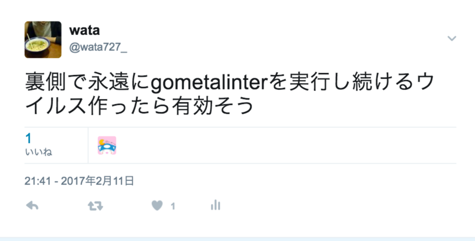

# GoとLintのおいしい関係

@wata727  
[Go言語LT大会](https://go-beginners.connpass.com/event/55768/)

---


Kazuma Watanabe (@wata727) 

* Actcat, Inc ([SideCI](https://sideci.com))
* [Twitter](https://twitter.com/wata727_), [GitHub](https://github.com/wata727)

---

<ul>
<span class="menu"><li>Go 💙 Lint</li></span>
<span class="menu"><li>Lint 💛 Go</li></span>
</ul>

---

# Lint?

---

# Lint is ...

- コンパイラより詳細かつ厳密なチェック
- コンパイラではチェックされないが、バグの原因になるような曖昧な記述を警告する
- 各種言語で書かれた文書に対して文法チェックを行う

---

# Go 💙 Lint

---

# Golint

Goのスタイルチェッカー、[Effective Go](https://golang.org/doc/effective_go.html)や[Code Review Comments](https://github.com/golang/go/wiki/CodeReviewComments)にある推奨されるべき書き方に違反したコードを検出

```
package main

import "fmt"

func main() {
    // don't use underscores in Go names; var awesome_message should be awesomeMessage
    var awesome_message string = "Hello, World!"
    fmt.Print(awesome_message)
}
```

---

## Golintの良いところ

- 行の長さを制限しない

---

## 行の長さを制限しない
#### Ruby (RuboCop) の場合

```
def get_hoge(num1, num2, num3)
  # C: Line is too long. [87/80]
  AwesomeKlass.new(num1: num1, num2: num2).find_with_hoge.process_and_fuga(num3).chomp!
end
```

---

### git commit -m 'Fix line is too long'

```
def get_hoge(num1, num2, num3)
  AwesomeKlass.new(num1: num1, num2: num2)
    .find_with_hoge.process_and_fuga(num3)
    .chomp!
end
```

---

### git commit -m 'fixup! Fix line is too long'

```
def get_hoge(num1, num2, num3)
  awesome_with_find(AwesomeKlass.new(num1: num1, num2: num2), num3)
end

private

def awesome_with_find(awesome, num3)
  awesome_chomp!(awesome.find_with_hoge.process_and_fuga(num3))
end

def awesome_chomp!(awesome)
  awesome.chomp!
end
```

---

## Code Review Commentsより

There is no rigid line length limit in Go code, but avoid uncomfortably long lines. <b>Similarly, don't add line breaks to keep lines short</b> when they are more readable long--for example, if they are repetitive.

---

## 他にもあります

- [Govet](https://golang.org/cmd/vet/)
  - コンパイラよりも詳しい検査を行なう（ただし、すべてが真であることを保証しない）
- [Go Meta Linter](https://github.com/alecthomas/gometalinter)
  - サードパーティ含めたLinterのまとめ
  - セキュリティとか、typoとか

---

## ただしめちゃくちゃ重いです



---

# Lint 💛 Go

---

## 標準パーサーがある

```
package main

import (
    "go/parser"
    "go/token"

    "github.com/k0kubun/pp"
)

func main() {
    fset := token.NewFileSet()
    file, err := parser.ParseFile(fset, "sample.go", nil, 0)
    if err != nil {
        panic(err)
    }

    pp.Print(file)
}
```

---

### 何が嬉しいのか

- 新しいシンタックスに追従してる（はず）
- 色んなパーサーの表現方式を覚える必要が無い
- 公式がサポートしている安心感

---

### GoはLinterが多い？

- [jgautheron/goconst](https://github.com/jgautheron/goconst)のような小さなLinterがとても多い印象
- 簡単にLinterを作りやすいから？
- それらをまとめるためにMeta Linterがあるのかもしれない

---

## Linterを作りやすい
Terraformのapplyがしょっちゅう死ぬので、チェックするLinterを作りたかった ([wata727/tflint](https://github.com/wata727/tflint))

- 色んなOSで動いてほしい
  - [mitchellh/gox](https://github.com/mitchellh/gox)
- 動かすための依存は最小にしたい
  - バイナリ1つでOK

---

### Docker imageは 33MB (๑˃̵ᴗ˂̵)و

```
FROM alpine:3.5

MAINTAINER wata727

COPY dist/linux_amd64/tflint /usr/local/bin

ENTRYPOINT ["tflint"]
```

---

# まとめ

- GoではLintを使おう！
- Linterを作るならGoを書こう！

